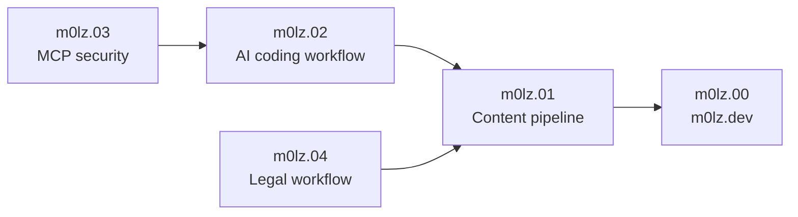

# Hey, I'm Jacob

**AI Product Engineer & Technical Founder** - I build AI systems that move from prototype to production: agentic workflows, evaluation pipelines, product automation, and applied SaaS.

15+ shipped products. 7,100+ GitHub contributions in the last 12 months.

---

### Current focus

- **AI developer tools** that make AI-assisted engineering more rigorous, reviewable, and repeatable.
- **Production AI systems** for revenue operations, legal workflows, technical content, and internal automation.
- **Open source contributions** across developer tools, AI infrastructure, language tooling, and Python/Rust/TypeScript codebases.
- **Evaluation-driven workflows** where "done" is defined before implementation and verified after.

---

### Recent open source work

**[TrustGraph](https://github.com/trustgraph-ai/trustgraph)** - Python AI infrastructure and knowledge-graph tooling.

- [trustgraph-ai/trustgraph#955](https://github.com/trustgraph-ai/trustgraph/pull/955) - tightened WebSocket client exception handling and added regression coverage.
- [trustgraph-ai/trustgraph#954](https://github.com/trustgraph-ai/trustgraph/pull/954) - replaced a broad prompt-manager exception handler with specific exception handling.
- [trustgraph-ai/trustgraph#952](https://github.com/trustgraph-ai/trustgraph/pull/952) - improved cache-directory error handling in sample document loading.

**[AWS IAM Policy Autopilot](https://github.com/awslabs/iam-policy-autopilot)** - Rust tooling for generating least-privilege IAM policies.

- [awslabs/iam-policy-autopilot#217](https://github.com/awslabs/iam-policy-autopilot/pull/217) - made the policy-generation resource cutoff configurable across CLI, MCP, and library paths.
- [awslabs/iam-policy-autopilot#214](https://github.com/awslabs/iam-policy-autopilot/pull/214) - added pre-commit hooks and local validation documentation.

**[Harper](https://github.com/Automattic/harper)** - Rust grammar and spell-checking engine.

- [Automattic/harper#3460](https://github.com/Automattic/harper/pull/3460) - fixed a grammar false positive for built-in verb phrases.

---

### How to navigate my work

**[m0lz.00](https://github.com/jmolz/m0lz.00)** is the canonical site and writing hub: [m0lz.dev](https://m0lz.dev).

**[m0lz.01](https://github.com/jmolz/m0lz.01)** is the local idea-to-distribution pipeline that researches, drafts, evaluates, publishes, and distributes technical content.

**[m0lz.02](https://github.com/jmolz/m0lz.02)** is the AI coding workflow orchestrator: Plan -> Implement -> Contract-Evaluate with dual-model adversarial review.

**[m0lz.03](https://github.com/jmolz/m0lz.03)** is a security proxy daemon for MCP servers: auth, rate limiting, PII detection, permission scoping, and audit logging.

**[m0lz.04](https://github.com/jmolz/m0lz.04)** is an AI-powered legal case-management system for pro se litigants.

---

### Public projects

**[m0lz.00](https://github.com/jmolz/m0lz.00)** - Monochrome developer blog and portfolio. Static Next.js site with MDX content, generative branch-mark identity, OG images, RSS, dark/light theme, and a content pipeline driven by m0lz.01. *Next.js / TypeScript*

**[m0lz.01](https://github.com/jmolz/m0lz.01)** - Automated content publishing agent. Commits MDX posts to m0lz.00, produces platform images, prepares distribution kits, and supports cross-post workflows. *TypeScript*

**[m0lz.02](https://github.com/jmolz/m0lz.02)** - Structured AI coding workflow orchestrator. Plan, Implement, Contract-Evaluate with adversarial evaluation, WISC context management, and tiered verification. *Rust / TypeScript*

**[m0lz.03](https://github.com/jmolz/m0lz.03)** - Security proxy daemon for MCP servers. Authentication, rate limiting, PII detection, permission scoping, audit logging, and attack-scenario validation. *TypeScript*

**[m0lz.04](https://github.com/jmolz/m0lz.04)** - AI-powered legal case management for pro se litigants. Court filing monitor, deadline tracker, citation verification, red team analysis, and DOCX export. Local-first and privacy-focused. *JavaScript / Claude API*

**[Investor Matchmaker](https://github.com/Raleigh-Durham-Startup-Week/investor-matchmaker)** - Investor-founder meeting scheduler for Startup Week. Greedy bipartite matching across investment type, business type, and sector with Excel I/O. *Python*

---

### How I build: m0lz.02

m0lz.02 implements a structured methodology for AI-assisted engineering:

- **Contracts** define "done" before any code is generated.
- **Dual-model adversarial evaluation** uses different model families to expose different blind spots.
- **WISC context management** - Write, Isolate, Select, Compress - keeps long-running AI work grounded.
- **Tiered evaluation rigor** scales verification to the risk of the change.

---

### Tech stack

**Languages & Frameworks:** `TypeScript` `Python` `Rust` `Next.js` `FastAPI` `Laravel` `Django` `React`

**AI/ML:** `Claude API` `OpenAI API` `Multi-Agent Architectures` `MCP Servers` `LLM Orchestration` `RAG Pipelines` `Embedding Models` `Rerankers` `scikit-learn` `Computer Vision`

**Model Deployment & Infrastructure:** `Self-Hosted Open-Weight Models` `Quantized Models for High-Throughput ETL` `Full-Weight Models for Deep Analysis` `RunPod GPU` `Docker-Based Model Serving` `Secure Closed-Environment Inference`

**Infrastructure:** `Docker` `PostgreSQL` `Supabase` `Redis` `CI/CD`

---

### Private production systems

**[Bloom](https://meetbloom.io)** - AI-powered revenue discovery for service businesses. Satellite measurement, AI proposals, and Bloom Intelligence email personalization. *TypeScript / Next.js*

**[Alpaka](https://alpaka.ai)** - Value-chain intelligence for real estate. Scope 3 carbon emissions ML modeling, supply-chain optimization, and vendor management. *Python ML / TypeScript*

**[Ready Text](https://ready-text.com)** - Waitlist texting and customer alert platform for restaurants and businesses. Live SaaS with paying customers. *Laravel / PHP*

---

### The numbers

- **7,100+** contributions in the last 12 months
- **15+** products built from zero to production
- **4** companies co-founded with technical leadership
- **2,900+** commits on Alpaka alone

---

### Previously

15 years of B2B SaaS leadership at companies including 24/7 Software and CleanAir.ai. I build AI systems with a product operator's bias toward deployment, adoption, and business value.

**MBA** - Nova Southeastern University

**BSBA, Entrepreneurship** - University of Central Florida
