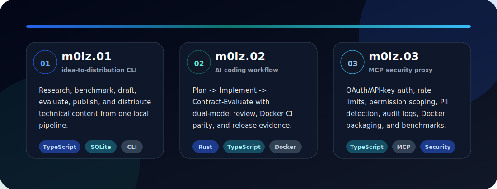
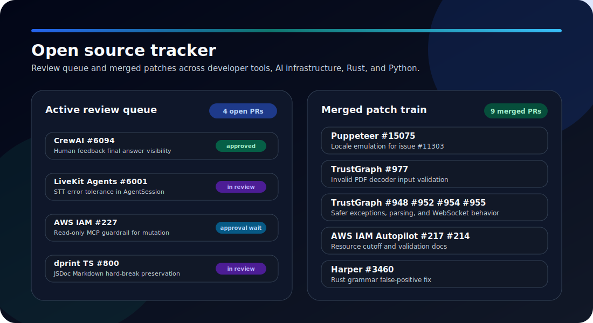
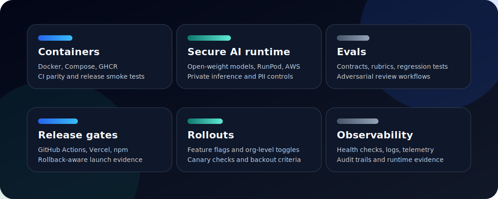
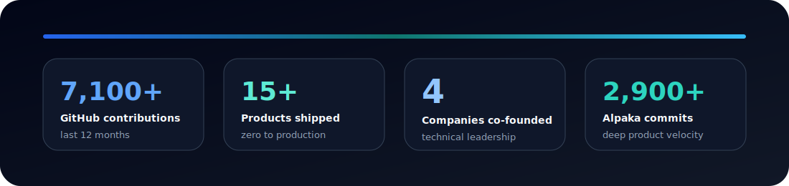

<h1 align="center">Jacob Molz</h1>

  <strong>Full-stack software engineer building AI SaaS platforms, developer tools, eval workflows, and secure model/runtime infrastructure.</strong>

  <a href="https://m0lz.dev">m0lz.dev</a> ·
  <a href="https://www.linkedin.com/in/jacobmolz">LinkedIn</a> ·
  <a href="mailto:jmolz12@gmail.com">Email</a> ·
  <a href="https://github.com/jmolz">GitHub</a>

  
  
  

I help teams turn AI prototypes, internal tools, and high-leverage product ideas into production SaaS systems: data contracts, model/runtime choices, secure infrastructure, evals, observability, deployment gates, and user-facing workflows that hold up after launch.

Most recently at REVGEN, I built production AI and SaaS systems across **Next.js, React, TypeScript, Python, Supabase/PostgreSQL, Docker, RunPod, Vercel, GitHub Actions, Twilio, SendGrid, Stripe, QuickBooks, Gmail, and ShareFile**.

I am currently focused on **full-stack software engineering, AI SaaS platforms, contract engineering, applied AI consulting, developer tools, eval infrastructure, secure model runtimes, and platform/reliability work**.

---

## Where I Can Help

| Problem | What I build |
| --- | --- |
| AI feature stuck at prototype | Production workflows with data boundaries, model/runtime selection, evals, observability, and release gates |
| Code review or eval work for AI labs | Coding-task evaluation, edge-case design, regression tests, review rubrics, and failure taxonomy |
| Secure or private AI deployment | Dockerized inference, open-weight model runtime tradeoffs, closed-environment operation, audit trails, and PII controls |
| SaaS workflows that need engineering/product judgment | Multi-tenant apps, RLS/auth, integrations, feature flags, rollout plans, and customer-facing automation |
| Developer-tooling or platform gaps | CLIs, MCP tools, workflow orchestration, CI parity, release automation, metrics, and smoke-test evidence |
| OSS or existing-codebase fixes | Focused patches that fit local architecture, respond to maintainer feedback, and include targeted validation |

---

## Featured Systems

  

  
  
  

**[m0lz.01](https://github.com/jmolz/m0lz.01)** is the local idea-to-distribution pipeline behind [m0lz.dev](https://m0lz.dev): research, benchmark, draft, evaluate, publish, and distribute technical content.

**[m0lz.02](https://github.com/jmolz/m0lz.02)** is a Rust/TypeScript AI coding workflow orchestrator: Plan -> Implement -> Contract-Evaluate, dual-model adversarial review, context-isolated evaluators, Docker CI parity, Windows smoke tests, npm distribution, and release evidence.

**[m0lz.03](https://github.com/jmolz/m0lz.03)** is a TypeScript MCP security proxy: OAuth 2.1/API-key auth, permission scoping, rate limiting, bidirectional PII detection, queryable audit logs, optional SQLCipher, Docker packaging, and benchmark coverage.

---

## Recent Open Source Work

  

Status snapshot checked with GitHub CLI on July 13, 2026.

| Lane | Project | Work item | Status |
| --- | --- | --- | --- |
| Active review | [CrewAI](https://github.com/crewAIInc/crewAI) | [#6094](https://github.com/crewAIInc/crewAI/pull/6094) human feedback final answer visibility | Open, mergeable, CodeRabbit-approved; CodeRabbit and GitGuardian checks green |
| Active review | [LiveKit Agents](https://github.com/livekit/agents) | [#6001](https://github.com/livekit/agents/pull/6001) STT error-tolerance handling in `AgentSession` | Open, mergeable; maintainer review required; CLA, CI, tests, and release gate green |
| Active review | [AWS IAM Policy Autopilot](https://github.com/awslabs/iam-policy-autopilot) | [#227](https://github.com/awslabs/iam-policy-autopilot/pull/227) read-only MCP server guardrail for IAM policy mutation | Open; maintainer review required; issue [#92](https://github.com/awslabs/iam-policy-autopilot/issues/92) linked; no visible check rollup |
| Active review | [Deno / dprint TypeScript plugin](https://github.com/dprint/dprint-plugin-typescript) | [#800](https://github.com/dprint/dprint-plugin-typescript/pull/800) preserve Markdown hard breaks in JSDoc formatting for Deno issue [#31831](https://github.com/denoland/deno/issues/31831) | Open, mergeable; maintainer review pending; no visible check rollup |
| Merged | [Puppeteer](https://github.com/puppeteer/puppeteer) | [#15075](https://github.com/puppeteer/puppeteer/pull/15075) page-level locale emulation across CDP and WebDriver BiDi, closing issue [#11303](https://github.com/puppeteer/puppeteer/issues/11303) | Merged 2026-06-11 |
| Merged | [TrustGraph](https://github.com/trustgraph-ai/trustgraph) | [#977](https://github.com/trustgraph-ai/trustgraph/pull/977) reject invalid PDF decoder input for issue [#949](https://github.com/trustgraph-ai/trustgraph/issues/949) | Merged 2026-06-09 |
| Merged | [TrustGraph](https://github.com/trustgraph-ai/trustgraph) | [#955](https://github.com/trustgraph-ai/trustgraph/pull/955), [#954](https://github.com/trustgraph-ai/trustgraph/pull/954), [#952](https://github.com/trustgraph-ai/trustgraph/pull/952) (resolving issue [#869](https://github.com/trustgraph-ai/trustgraph/issues/869)), and [#948](https://github.com/trustgraph-ai/trustgraph/pull/948): exception handling, cache parsing, metric-label parsing, and WebSocket fixes | Merged; #869 confirmed resolved and maintainer closure requested 2026-07-13 |
| Merged | [AWS IAM Policy Autopilot](https://github.com/awslabs/iam-policy-autopilot) | [#217](https://github.com/awslabs/iam-policy-autopilot/pull/217) configurable policy-generation resource cutoff | Merged 2026-06-09 |
| Merged | [AWS IAM Policy Autopilot](https://github.com/awslabs/iam-policy-autopilot) | [#214](https://github.com/awslabs/iam-policy-autopilot/pull/214) pre-commit hooks and local validation documentation | Merged |
| Merged | [Harper](https://github.com/Automattic/harper) | [#3460](https://github.com/Automattic/harper/pull/3460) Rust grammar false-positive fix for built-in verb phrases | Merged |

---

## Proof Matrix

  

---

## Core Stack

  
  
  
  
  
  
  
  
  
  
  
  
  
  
  
  
  
  
  
  
  
  
  

**Application stack:** TypeScript, JavaScript, Python, Rust, React, Next.js, Node.js, FastAPI, Django, Laravel, HTML, CSS, Tailwind CSS, Vite.

**AI/ML:** open-weight models, secure inference, model runtime selection, RAG, embeddings, rerankers, pgvector, MCP, multi-agent workflows, LLM orchestration, evaluation pipelines, Whisper, pyannote, Hugging Face, PyTorch, Vercel AI SDK, OpenAI API, Claude/Anthropic API.

**Infrastructure and delivery:** Docker, Docker Compose, RunPod, AWS, Vercel, GitHub Actions, GHCR, CI/CD, release automation, Supabase, Neon/PostgreSQL, Redis, Drizzle ORM.

**Reliability and security:** observability, telemetry, health checks, audit logging, feature flags, progressive rollouts, OAuth, JWT, RBAC, RLS, PII detection, rate limiting, SQLCipher, Playwright, Jest, Vitest, pytest.

---

## Production Systems

**SalesForge AI** (internal): call-intelligence and coaching platform. Ingests Coffee/Levitate recordings, runs Dockerized RunPod inference with Whisper large-v3 and pyannote, extracts deterministic metrics, submits budget-controlled Anthropic Batch evaluations, and surfaces cited coaching insights in dashboards and chat. Includes durable heartbeats, Slack alerts, completion catch-up, poll-only reconciliation, production DB verification, and RunPod/Docker deploy reconciliation.

**[Bloom](https://meetbloom.io)**: multi-tenant SaaS for landscaping and service businesses. Customer segmentation, campaigns, proposals, invoice workflows, routing/dispatch concepts, conversational AI assistance, org-scoped auth, RLS-backed data isolation, feature flags, structured logging, E2E/regression suites, and integrations across Stripe, Twilio, SendGrid, Gmail, QuickBooks, and Vercel Analytics.

**[Alpaka](https://alpaka.ai)**: value-chain intelligence software using Next.js, Python FastAPI, Docker Compose, pgvector, semantic search, reranking, groundedness scoring, multi-agent synthesis, open-weight Qwen runtimes, Vercel, and RunPod.

**[Ready Text Legal](https://ready-text.com)**: invite-only legal client communication workspace with Supabase auth/RLS, case/contact management, consent tracking, SMS/MMS workflows, multilingual templates, approval gates, automation controls, audit archives, billing, and launch-readiness validation.

---

## Public Project Map

| Project | What it proves | Stack |
| --- | --- | --- |
| **[m0lz.00](https://github.com/jmolz/m0lz.00)** | Portfolio and technical writing hub at [m0lz.dev](https://m0lz.dev) | Next.js, TypeScript, MDX |
| **[m0lz.01](https://github.com/jmolz/m0lz.01)** | Local idea-to-distribution pipeline for research, drafting, evaluation, and publishing | TypeScript, SQLite, CLI |
| **[m0lz.02](https://github.com/jmolz/m0lz.02)** | Contract-driven AI coding workflow orchestration and release evidence | Rust, TypeScript, JSON-RPC |
| **[m0lz.03](https://github.com/jmolz/m0lz.03)** | MCP security proxy, permissions, audit logs, benchmarked tool boundaries | TypeScript, Docker, SQLite |
| **[m0lz.04](https://github.com/jmolz/m0lz.04)** | AI-powered legal case management for pro se litigants | JavaScript, Claude API |
| **[Investor Matchmaker](https://github.com/Raleigh-Durham-Startup-Week/investor-matchmaker)** | Investor-founder meeting scheduler with greedy bipartite matching and Excel I/O | Python |

---

## The Numbers

  

---

## Previously

Before moving full time into engineering, I spent 15 years in B2B SaaS leadership at companies including 24/7 Software and CleanAir.ai. That background shows up in how I build: I care about deployment, adoption, customer workflows, business value, and operational ownership.

- **MBA** - Nova Southeastern University
- **BSBA, Entrepreneurship** - University of Central Florida
